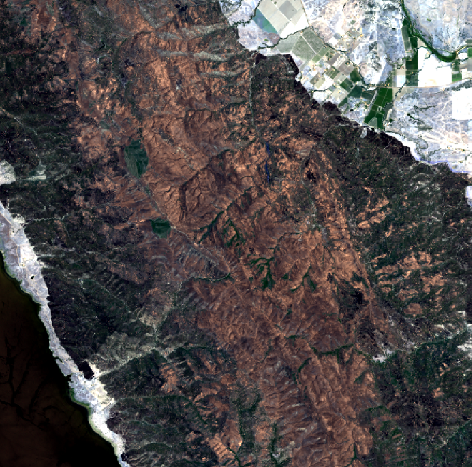
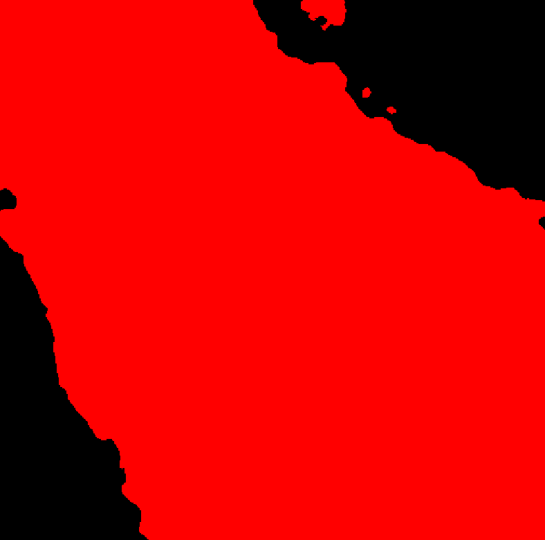

# Performing an inference task with TerraTorch CLI: the Burn Scars test case

## Step 1: Download the test case from HuggingFace
We will use the burn scars identification test case, in which we are interested in estimating the area
affected by wildfires using a finetuned model (Prithvi-EO backbone + CNN decoder). To download the complete
example, do:
```sh
git clone https://huggingface.co/ibm-nasa-geospatial/Prithvi-EO-2.0-300M-BurnScars/
```
## Step 2: Run the default inference case
The example you downloaded already contains some sample images to be used as input, so you just need to go to
the local repository and create a directory to save the outputs:
```sh
cd Prithvi-EO-2.0-300M-BurnScars
mkdir outputs
```
and to execute a command line like:
```sh
terratorch predict -c burn_scars_config.yaml --predict_output_dir outputs/ --data.init_args.predict_data_root examples/ --ckpt_path Prithvi_EO_V2_300M_BurnScars.pt
```
You will see the outputs being saved in the `outputs` directory. 

### Input image (RGB components)



### Predicted mask

}

# More examples

For some examples of training using the existing tasks, check out the following pages on our github repo:

## From config files

Under `examples/confs`

* Flood Segmentation with ViT: `sen1floods11_vit.yaml`

* Flood Segmentation with ViT and an SMP head: `sen1floods11_vit_smp.yaml`

* Flood Segmentation with ViT and an MMSeg head: `sen1floods11_vit_mmseg.yaml`

* Multitemporal Crop Segmentation: `multitemporal_crop.yaml`

* Burn Scar Segmentation: `burn_scars.yaml`

* Scene Classification: `eurosat.yaml`

External examples available in [Prithvi-EO-2.0](https://github.com/NASA-IMPACT/Prithvi-EO-2.0)

* [Carbon Flux](https://github.com/NASA-IMPACT/Prithvi-EO-2.0/tree/main/examples/carbon_flux)
* [Landslide](https://github.com/NASA-IMPACT/Prithvi-EO-2.0/blob/main/examples/example_landslide4sense.ipynb)
* [Multitemporal Crop](https://github.com/NASA-IMPACT/Prithvi-EO-2.0/blob/main/examples/example_multitemporalcrop.ipynb)
