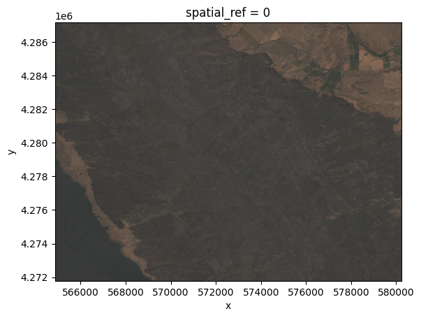
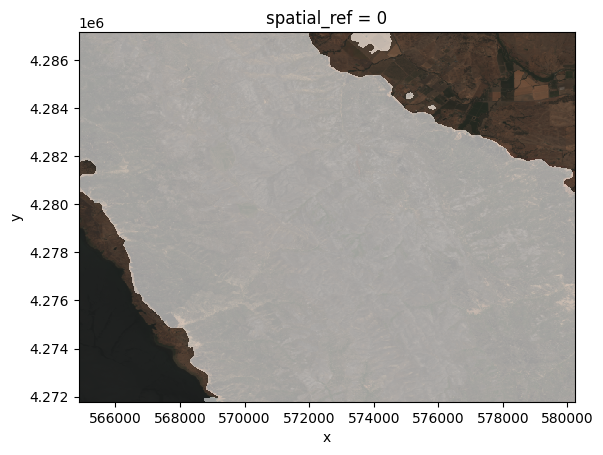
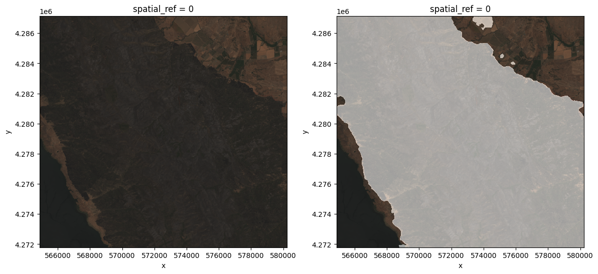
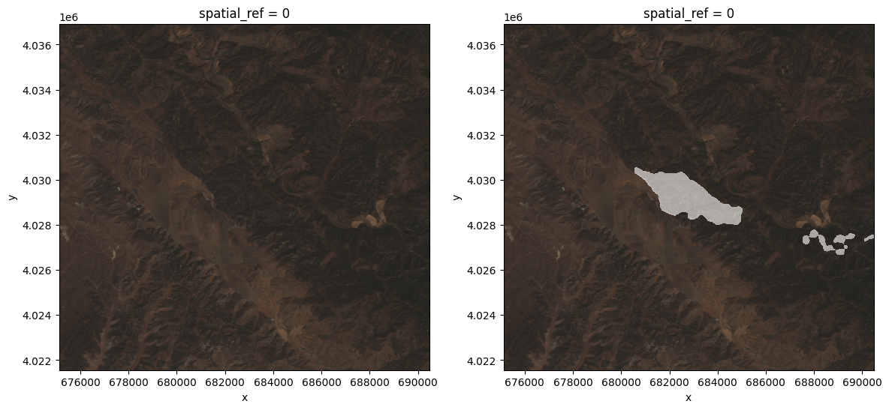
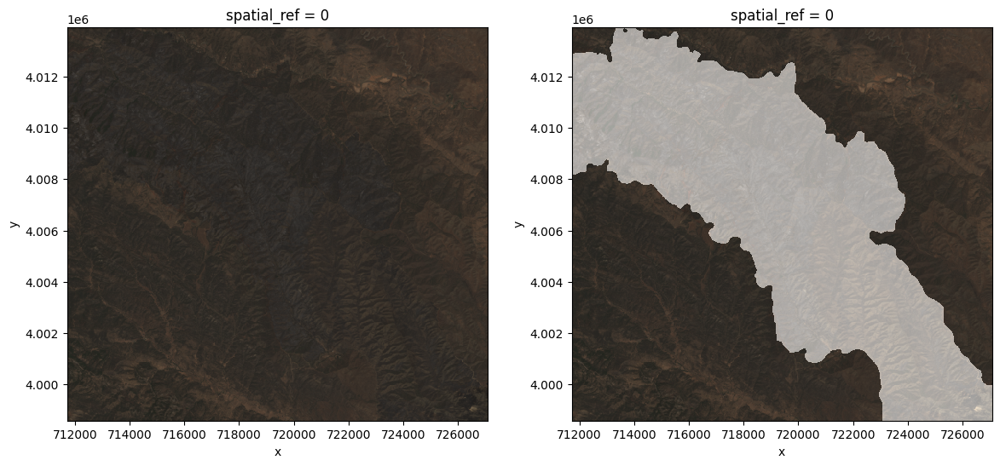
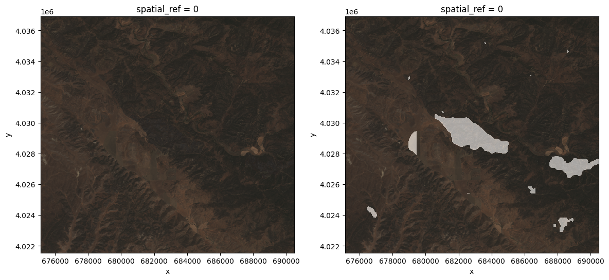
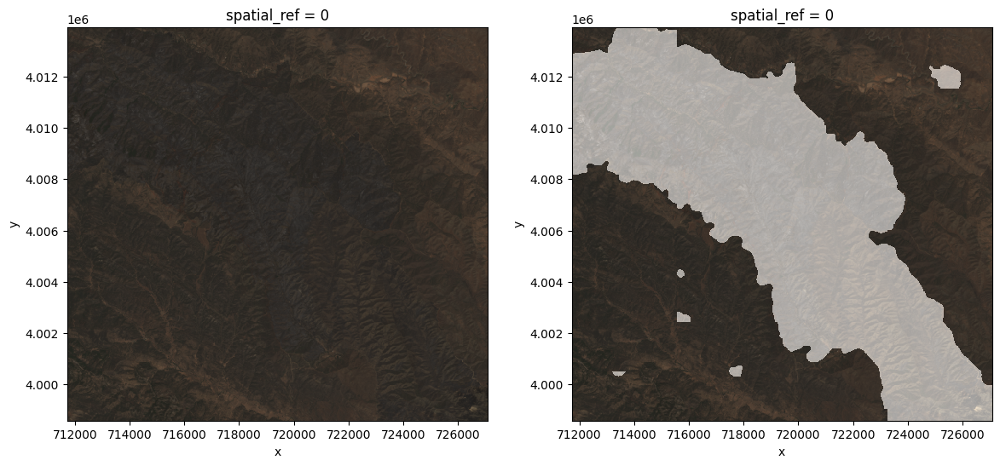

# Performing a simple inference task using the TerraTorch's script interface. 

## **Direct inference (or full image inference).**


```python
import argparse
import os
from typing import List, Union
import re
import datetime
import numpy as np
import rasterio
import torch
import rioxarray
import yaml
from einops import rearrange
from terratorch.cli_tools import LightningInferenceModel
from terratorch.utils import view_api
```

### The directory in which we will save the model output.


```python
output_dir = "inference_output"
```

### The path to the configuration (YAML) file.


```python
config_file = "burn_scars_config.yaml"
```

### The path to the local checkpoint (a file storing the model weights).


```python
checkpoint = "checkpoints/Prithvi_EO_V2_300M_BurnScars.pt"
```

### The path for the directory containing the input images.


```python
input_dir = "data/examples/"
```

### An image chosen to be used in the single-file inference. 


```python
example_file = "data/examples/subsetted_512x512_HLS.S30.T10SEH.2018190.v1.4_merged.tif"
```

### A list indicating the bands contained in the input files. 


```python
predict_dataset_bands=[
      "BLUE",
      "GREEN",
      "RED",
      "NIR_NARROW",
      "SWIR_1",
      "SWIR_2",
  ]
```

### A subset of the dataset bands to be used as input for the model. 


```python
predict_output_bands = predict_dataset_bands
```

### Creating a directory to store the output (when it does not exist).


```python
os.makedirs(output_dir, exist_ok=True)
```

### Instantiating the model from the config file and the others arguments defined previously.


```python
lightning_model = LightningInferenceModel.from_config(config_file, checkpoint, predict_dataset_bands, predict_output_bands)
```

### Performing the inference for a single file. The output is a tensor (`torch.Tensor`). 

```python
prediction = lightning_model.inference(example_file)
prediction
```

```
    tensor([[1, 1, 1,  ..., 0, 0, 0],
            [1, 1, 1,  ..., 0, 0, 0],
            [1, 1, 1,  ..., 0, 0, 0],
            ...,
            [0, 0, 0,  ..., 1, 1, 1],
            [0, 0, 0,  ..., 1, 1, 1],
            [0, 0, 0,  ..., 1, 1, 1]])
```

### Visualizing the input image.
From the file object `fp` we select just the bands corresponding to RGB (indexes que correspondem aos índices 2, 1 and 0 of the TIFF file) for sake of visualization. Notice that we added a shift to white (`fp[[2,1,0]]+0.20`) in order to lighten the image. 


```python
import rioxarray
fp = rioxarray.open_rasterio(example_file)
(fp[[2,1,0]]+0.20).plot.imshow(rgb="band")
```

    

    

Visualizing the output image. 

```python
import matplotlib.pyplot as plt
(fp[[2,1,0]] + 0.10 + 0.5*np.stack(3*[prediction], axis=0)).plot.imshow(rgb="band")
```

    

    

We also can perform inference for an entire directory of images by using the 


```python
predictions, file_names = lightning_model.inference_on_dir(input_dir)
```

This operation will return two lists, one containing predictions and another with the names of the corresponding input files. 


```python
for pred, input_file in zip(predictions, file_names):
    fp = rioxarray.open_rasterio(input_file)              
    f, ax = plt.subplots(1,2, figsize=(14,6))
    (fp[[2,1,0]]+0.10).plot.imshow(rgb="band", ax=ax[0])
    (fp[[2,1,0]] + 0.10 + 0.5*np.stack(3*[pred], axis=0)).plot.imshow(rgb="band", ax=ax[1])
```


    

    


    

    


    

    


## **Tiled Inference**
 Now let's try an alternative form of inference - tiled inference. This type of inference is useful when the GPU (or the RAM associated with the CPU, if applicable) is insufficient to allocate all the information needed to run the model (basic libraries, model and data), because instead of applying the model to the whole image, it divides it into small rectangles, the dimensions of which are defined by the user, applies the model separately and then reconstructs the output figure. To perform this type of inference, we will use the file below. 


```python
config_file_tiled = "burn_scars_config_tiled.yaml"
```

### Notice that the content is identical to the other YAML file, but the addition of the subfield: 
```
    tiled_inference_parameters:
      h_crop: 128
      h_stride: 64
      w_crop: 128
      w_stride: 64
      average_patches: true

```
to the variables sent to the field `model`. The variables containing the suffix `_crop` refer to the dimensions of the tiles while those ones with the suffix `_stride` control the distance between them (the tiles can overlap).  


```python
lightning_model = LightningInferenceModel.from_config(config_file_tiled, checkpoint, predict_dataset_bands, predict_output_bands)
```

```python
predictions, file_names = lightning_model.inference_on_dir(input_dir)
```

```python
for pred, input_file in zip(predictions, file_names):
    fp = rioxarray.open_rasterio(input_file)
    f, ax = plt.subplots(1,2, figsize=(14,6))
    (fp[[2,1,0]]+0.10).plot.imshow(rgb="band", ax=ax[0])
    (fp[[2,1,0]] + 0.10 + 0.5*np.stack(3*[pred], axis=0)).plot.imshow(rgb="band", ax=ax[1])
```

    

    


    

    


    

    

