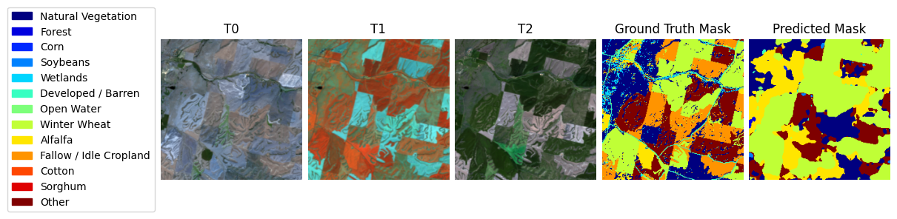

# Using a dedicated datamodule to perform inference: the crop classification example. 

### To run this example, the following packages are necessary.


```python
!pip install terratorch gdown tensorboard >& install.log
```


```python
import os
import sys
import torch
import gdown
import terratorch
import albumentations
import lightning.pytorch as pl
import matplotlib.pyplot as plt
from terratorch.datamodules import MultiTemporalCropClassificationDataModule
import warnings
```

### Downloading a random subset of the required dataset (~1 GB).

```python
if not os.path.isfile('multi-temporal-crop-classification-subset.tar.gz'):
    !gdown 1LL6thkuKA0kVyMI39PxgsrJ1FJJDV7-u

if not os.path.isdir('multi-temporal-crop-classification-subset/'):
    !tar -xzvf multi-temporal-crop-classification-subset.tar.gz

dataset_path = "multi-temporal-crop-classification-subset"
```

### Instantiating the corresponding datamodule. 


```python
datamodule = MultiTemporalCropClassificationDataModule(
    batch_size=8,
    num_workers=2,
    data_root=dataset_path,
    train_transform=[
        terratorch.datasets.transforms.FlattenTemporalIntoChannels(),  # Required for temporal data
        albumentations.D4(), # Random flips and rotation
        albumentations.pytorch.transforms.ToTensorV2(),
        terratorch.datasets.transforms.UnflattenTemporalFromChannels(n_timesteps=3),
    ],
    val_transform=None,  # Using ToTensor() by default
    test_transform=None,
    expand_temporal_dimension=True,
    use_metadata=False, # The crop dataset has metadata for location and time
    reduce_zero_label=True,
)

# Setup train and val datasets
datamodule.setup("predict")
```

### Visualizing a few samples. 


```python
for i in range(5):
    datamodule.predict_dataset.plot(datamodule.predict_dataset[i])
```


    

    


    

    


    

    


    

    


    

    


### Downloading the best pretrained checkpoint. 


```python
best_ckpt_100_epoch_path = "multicrop_best-epoch=76.ckpt"

if not os.path.isfile(best_ckpt_100_epoch_path):
    gdown.download("https://drive.google.com/uc?id=1o1Hzd4yyiKyYdzfotQlEOeGTjsM8cHSw")
```

### Instantiating the Lightning Trainer.


```python
checkpoint_callback = pl.callbacks.ModelCheckpoint(
    dirpath="output/multicrop/checkpoints/",
    mode="max",
    monitor="val/Multiclass_Jaccard_Index", # Variable to monitor
    filename="best-{epoch:02d}",
)
trainer = pl.Trainer(
    accelerator="auto",
    strategy="auto",
    devices=1, # Lightning multi-gpu often fails in notebooks
    precision='bf16-mixed',  # Speed up training
    num_nodes=1,
    logger=True, # Uses TensorBoard by default
    max_epochs=1, # For demos
    log_every_n_steps=5,
    enable_checkpointing=True,
    callbacks=[checkpoint_callback, pl.callbacks.RichProgressBar()],
    default_root_dir="output/multicrop",
)
```

### Instantiating the task to handle the model.

```python
model = terratorch.tasks.SemanticSegmentationTask(
    model_factory="EncoderDecoderFactory",
    model_args={
        # Backbone
        "backbone": "prithvi_eo_v2_300", 
        "backbone_pretrained": True,
        "backbone_num_frames": 3,
        "backbone_bands": ["BLUE", "GREEN", "RED", "NIR_NARROW", "SWIR_1", "SWIR_2"],
        "backbone_coords_encoding": [], # use ["time", "location"] for time and location metadata

        # Necks 
        "necks": [
            {
                "name": "SelectIndices",
                "indices": [5, 11, 17, 23] 
            },
            {
                "name": "ReshapeTokensToImage",
                "effective_time_dim": 3
            },
            {"name": "LearnedInterpolateToPyramidal"},            
        ],
        
        # Decoder
        "decoder": "UNetDecoder",
        "decoder_channels": [512, 256, 128, 64],
        
        # Head
        "head_dropout": 0.1,
        "num_classes": 13,
    },
    
    loss="ce",
    lr=1e-4,
    optimizer="AdamW",
    ignore_index=-1,
    freeze_backbone=True,  
    freeze_decoder=False,
    plot_on_val=True,
    
)
```

### Predicting for some samples in the prediction dataset.


```python
preds = trainer.predict(model, datamodule=datamodule, ckpt_path=best_ckpt_100_epoch_path)
# get data 
data_loader = trainer.predict_dataloaders
batch = next(iter(data_loader))

BATCH_SIZE = 8
for i in range(BATCH_SIZE):

    sample = {key: batch[key][i] for key in batch}
    sample["prediction"] = preds[0][0][i].cpu().numpy()

    datamodule.predict_dataset.plot(sample)
```

    

    


    

    


    

    


    

    


    

    


    

    


    

    


    

    

